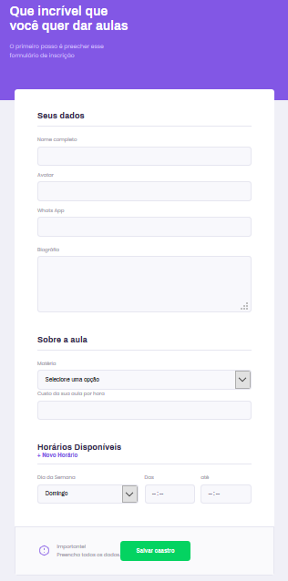

# Projeto Proffy

## Descrição Resumida

Este repositório faz parte do projeto Proffy, desenvolvido durante a <a href="https://nextlevelweek.com/inscricao/2/" target="_blank">Next Level Week #2</a> promovida pela <a href="https://rocketseat.com.br" target="_blank">RocketSeat</a>.

**Nota**

A "Next Level Week" é um conjunto de aulas práticas em vídeo em que é desenvolvido um projeto.
As aulas são divididas em sub-conjuntos denominados "trilhas". A trilha desse projeto é a "Omnistack".

## Detalhes do projeto

### Ideia Principal

Plataforma onde estudantes podem encontrar professores para obterem aulas particulares. A plataforma irá atuar como uma ponte entre professores e estudantes.

### Stakeholders

* **Educador(a) ou Professor(a):** Profissional que oferece aulas particulares usando o sistema.
* **Estudante:** Pessoa que busca por aulas particulares usando o sistema.

**Nota**

*Stakeholders* são sistemas ou pessoas afetadas pelo sistema desenvolvido.

### Funcionalidades

#### Estudante

* Buscar aulas

#### Professor(a)

* Cadastrar aulas

### Telas

Landing Page - Home - Página Inicial

Página de Busca

Página de Cadastro de aulas

**Nota**

O Layout das telas do site e aplicativo são semelhantes.

## Links Externos

* RocketSeat: [https://rocketseat.com.br](https://rocketseat.com.br)

* Site Oficial "Next Level Week #2": [https://nextlevelweek.com/](https://nextlevelweek.com/)

## Este Repositório

Este repositório contém o sistema web deste projeto, isto é, um sistema acessado por um navegador, como o Mozilla Firefox ou Google Chrome.

## Demais Repositórios do projeto

* API: 
[https://github.com/fbnnd1/nlw2-proffy-server](https://github.com/fbnnd1/nlw2-proffy-server)

* Aplicativo para celular: 
[https://github.com/fbnnd1/nlw2-proffy-mobile](https://github.com/fbnnd1/nlw2-proffy-mobile)